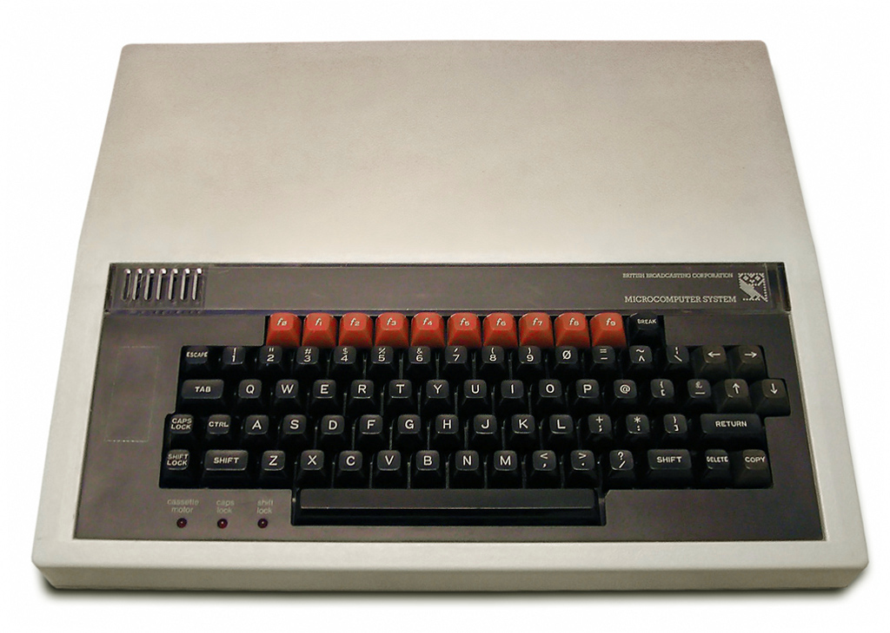
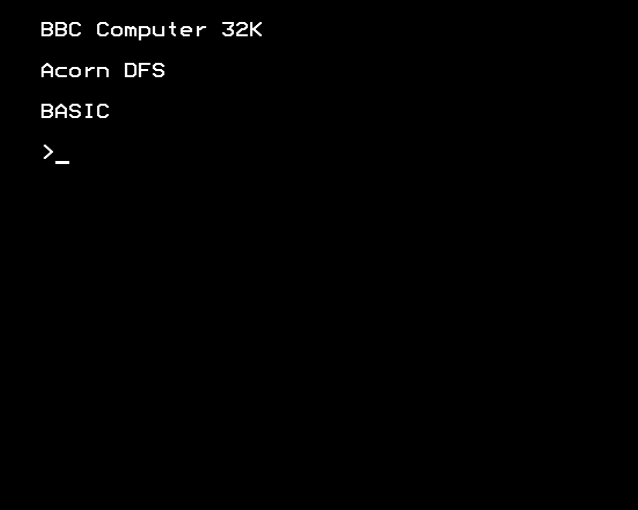
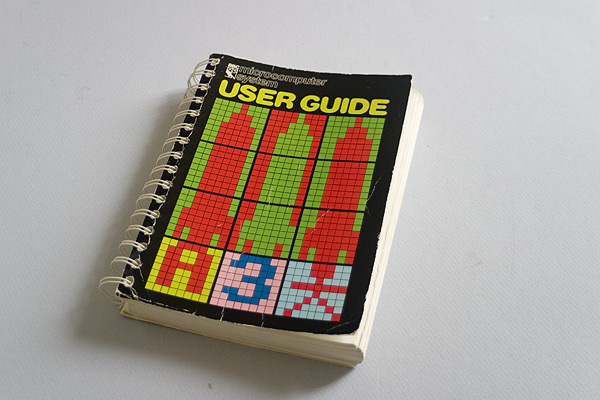
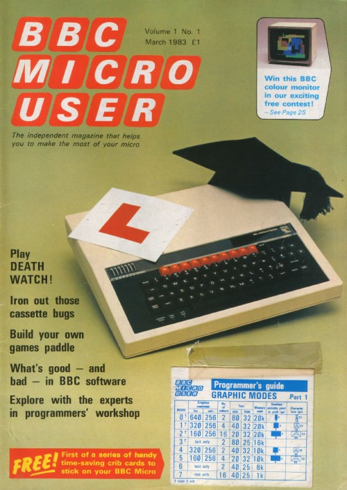
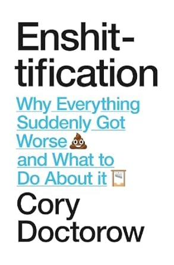
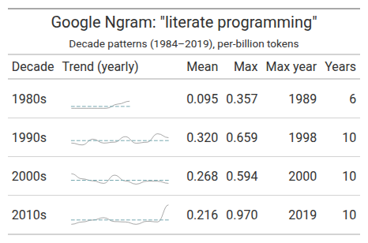
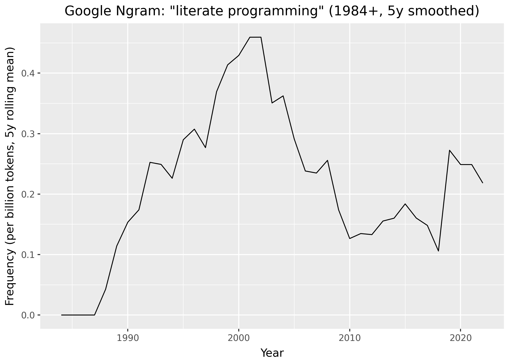

```{python}
#| echo: false

# Imports

import json
import csv
from pathlib import Path
import polars as pl
from great_tables import GT
from plotnine import ggplot, aes, geom_line, labs, theme_gray

```

# TODO

- Add clean code/pragmatic programming on documentation
- Add diagram note
- Add dataviz note

# In Praise of Documentation

This talk is in praise of documentation in data science and software engineering. By the end, I hope to have convinced you that documentation is a good thing, and that if you want your code to be used, you should document your code. I'll explore tools for data science understood and the idea that data science involves doing "literate programming" where we create "computational narrative".

I enjoy writing technical documentation. I enjoy trying to explain things to people. Helping people make sense of a report or a tool. But I realise my enjoyment is not shared widely in the field. While writing documentation is generally considered a "good thing", many engineers in industry tend to either not document their work, or document their work poorly. I'll speculate about why this might be the case. And I'll argue *why good documentation is always a good thing*. I'll give suggestions for how you can write documentation in the best way possible.

This document is written in [Quarto](https://quarto.org/), a Markdown format, that can be rendered into PDF or HTML format. To illustrate how Quarto works, I'll "show the code", reflexively illustrating how I wrote the documentation for this talk on documentation.

# How I Learned to Love Documentation

I first discovered the pleasures of technical documentation 40 years ago, as an 8 year old boy, using a BBC Microcomputer. 

{width=50%}

This computer was my best friend. The BBC Micro was an 8-bit computer, funded by the British Broadcasting Corporation (BBC), and released in 1981 as the centrepiece of their [Computer Literacy Project](https://clp.bbcrewind.co.uk/). 

This project aimed to make the British public more computer literate, by making computers and programming more widely accessible to the massses, mainly by making the BBC Micro available for use in schools @gazzard2016. The machine was designed and built by Acorn Computers in Cambridge, England who also built my first computer, the [Acorn Electron](https://en.wikipedia.org/wiki/Acorn_Electron), and the [ARM](https://en.wikipedia.org/wiki/ARM_architecture_family) processor - now powering most mobile phones. 

One of the distinctive features of the BBC Micro was that after you had plugged the computer into your TV set, when you switched on the computer (which made the sound "beeee-beep"), you immediately found yourself on what we now call a "command line", which looked something like this:

{width=50%}

I was faced with an immediate practical problem: how do I use this thing? Remember, at the time, I have no mouse, a keyboard as my input device, and there's no Graphical User Interface.

Thankfully, the computer came with a [User Guide](https://www.bbcmicrobot.com/docs/BBC_User_Guide.pdf). 

{width=50%}

It explained how to type BBC BASIC commands to "run" your programs using the keyboard. The programs would run from cassette tapes or 5 1/4 inch diskettes. There was also a magazine, [BBC Micro User](https://en.wikipedia.org/wiki/The_Micro_User), which I avidly collected. 

{width=50%}

I learnt to use the computer by reading this printed "physical" media. To use the computer, I had to type commands. It turns out, these were the commands of the programming language BBC BASIC. As soon as the machine had booted up, and typing commands, I was already programming. BBC BASIC was a scripting language, designed to be beginner-friendly, by Sophie Wilson of Acorn Computers. I learnt to program in BBC BASIC by manually typing out the 'type-in program' code listings for computer games in the magazines.

I tell you this story not only for nostalgic reasons, but also to impress upon you the important role played by documentation in my early experience with computers. Reading documentation was part-and-parcel of learning to use the computer. And learning to program. I learnt early the value of good documentation in democratising access to computers and to understanding the code that the computers "run" on them. I also learnt the value of early "open source" software in the form of 'type-in programs' in magazines.

In these early days of popular computing in Britain, learning the technical task of computer programming was intimately tied to reading the literature of documentation.

I later learned my early enjoyment for reading what we came to call "docs" was matched by an enjoyment in *writing* technical "docs". I enjoyed trying to explain to people things that were difficult to understand. Or describe how or why I did something the way I did it. Or tell the story of some feature or analysis. Essentially, I came to enjoy writing user guides.

I realised that by trying to explain something to someone, I often learnt something myself in the process. Something new about what I had done. Or what the analysis or the tool meant in the context of the project. Even just trying to explain to someone *how to run* some program was often fascinating to me. I guess writing a user guide is offering "tech support". Perhaps I felt I was being useful.

But I quickly realised other data scientists and software engineers often didn't share my interest or indeed passion for "docs". I often found people either wouldn't document their code at all, or they would document it poorly, only under duress. This makes sense, in part, due to the speed of work in industry. But I've found this attitude can lead to not only poor practice, but can even have disastrous consequencies for companies.

# The Perils of Poor Documentation

In one case, at a company to remain nameless, an entire data production system - and I am using that phrase generously - along with the new (second) cloud infrastructure built to replace it - were implemented either without any documentation, or with very poor documentation. 

The legacy system was filled with sprawling SQL scripts - the length of *War and Peace* - and SQL code was embedded into configuration files that were then executed by the production system (I never thought this was possible), and with the production database login and password details hardcoded into a Python script. All without any version control. (I never thought this was possible either!). And, just to add insult to injury, an entire Azure Data Lake was implemented by external consultants, to fix the legacy system - in addition to the existing cloud infrastructure - without writing any documentation at all. 

It was not just the length of the SQL scripts that was the problem. The SQL scripts seemed to have been written in such a style as to make their meaning and purpose entirely obscure to the reader. They had been written with a palpable carelessness. The reasons for why particular decisions were made had been left in the head of the programmer. Any institutional memory had been lost.

I realise this is an extreme example. The "bad" things that can happen without good documentation are usually more mundane. New colleagues might feel alienated, or struggle to quickly learn a new and complex codebase, or be unable to easily update a legacy system. Without documentation or institutional memory, it might take a whole team of PhD-level developers months, even years, to reverse engineer a large codebase, to be in a position to rebuild or replace it.

While digging into the archaeological sites of legacy codebases, I made an important realisation: code itself is a form of communication. Or, as I too often discovered, miscommunication. With or without documentation, poorly written code can have disastrous consequences for companies.

I think poorly written code, and software systems with poor or no documentation are part of what Corey Doctorow calls the "enshitification" of software. While I usually don't like "nomimal" words - when a noun is created out of a verb - and would warn against using them, because they usually make writing bad, I'll make an exception with "enshitification".

{width=25%}

How can we make our code communicate better? Or less shit?

# Why Document Your Code

Before I answer this question about "how" to document our code, I'll give evidence that it is not just me who thinks that documentation is a "good thing".

In her recent book *Software Engineering for Data Scientists*, Catherine Nelson writes:

> "Documentation is an often overlooked aspect of data science. It’s commonly left until the end of a project, but then you’re excited to move on to a new project, and the documentation is rushed or omitted completely. However, ... documentation is a crucial part of making your code reproducible. If you want other people to use your code, or if you want to come back to your code in the future, it needs good documentation. It’s impossible to remember all your thoughts from when you originally wrote the code or initially carried out the experiments, so they need to be recorded." @nelson2024

I would agree with all these points. I would also add that documentation is essential for understanding the meaning of the code. Why does it do what it does in the way that it does? Documentation is the best way to answer this and similar questions.

# Types of Documentation

Nelson summarises different types of documentation that are relevant to data science workflows. Here, I am directly quoting her recommendations, because I agree with them:

"*Names*: Names of variables, functions, and files should be informative, an appropriate length, and easy to read.

*Comments*: Your comments should add extra information not contained in the code, such as a summary or a caveat.

*Docstrings*: Your functions should always have a docstring that describes the inputs and outputs of the function, as well as the purpose of that function.

*READMEs*: Every repository or project should have an introduction that advertises your code and lets other people know why they should use it.

*Jupyter notebooks*: Your notebooks will be much easier to read if you give them good names, give them a structure, and intersperse text and code.

*Experiment tracking*: Experiments, especially in machine learning projects, should be tracked in a structured way."

In addition to these recommendations, we can also think about technical documentation in terms of different genres, which can help clarify the purpose of your documentation. The [Diátaxis](https://diataxis.fr/) documentation framework is an interesting example. It divides technical documents into four types: 

* Tutorials

* How-to guides

* Technical reference

* Explanation 

When writing your documentation, you could think about the purpose of the documentation, and which documentation type is most applicable for your use case. For a detailed explanation and application of Diátaxis, see this PyData [talk](https://youtu.be/buEKMi4tAew?si=t5fvKikngPt5ZhEX).

# Literate Programming

The advice given above by Nelson, especially the recommendation to use Jupyter notebooks, can be considered advice for "literate programming". 

Literate programming is perhaps the most commonly recommended *genre* or *style* of computer programming for data science. In literate programming, written prose is interspersed with computer code, within the same document, called a "notebook". Notebooks can be run locally (e.g. a Jupyter `.ipynb` file) or in cloud environments (e.g. [Azure Synapse](https://learn.microsoft.com/en-us/azure/synapse-analytics/spark/apache-spark-development-using-notebooks), [Databricks](https://docs.databricks.com/aws/en/notebooks/), or [Google Colab](https://colab.research.google.com/notebook)).

The popularity of the "notebook" format for data science makes sense, because data science involves scientific programming, and the structure advocated for literate programming resembles scientific writing - especially the genre of the scientific laboratory report. This report style is commonly structured into Introduction, Method, Results, and Conclusion sections. The "notebook" allows the data scientist to use a similar scientific report format. This is suitable for data exploration, experimentation, and communicating the results of research - especially reporting the findings of data analysis or machine learning experiments. Really, then, the argument for better documentation is an argument for better scientific research practice.

Quarto is a similar tool for literate programming, especially for scientific computing, where data analysis is presented within a report. For example, the following "code cell" executes a Python kernel (a virtual environment, in this case, using [uv](https://docs.astral.sh/uv/)), which in turn executes the `print` function, and the output of that function is displayed within the rendered document.

```{python}
"""
This is a docstring. 
It explains what a module, class, or function does.
Usually over multiple lines.
"""
# This is a comment, an explanation, on a single line. I'm illustrating "classic" software documentation.
print(f"O'Brien: How many fingers am I holding up, Winston? \n O'Brien holds up {2+2} fingers \n Winston: \"Four\"")
```

Code execution can also be done in-line, for example, O'Brien held up `{python} 2 + 2` fingers.

I was interested to find out when "literate programming" became popuar, so I used Google Books Ngram Viewer search for this term from 1800 to 2026. This shows the frequency of use of this term in published books.

I executed this command with `curl` from inside the `pydata/data` folder, which downloaded an `ngrams.json` file containing the data:

```
curl -L "https://books.google.com/ngrams/json?content=%22literate%20programming%22&year_start=1800&year_end=2026&corpus=26&smoothing=0" -o ngrams.json
```

I converted the JSON file to a CSV and then imported it as a DataFrame using [Polars](https://pola.rs/), a DataFrame library written in Rust, with an intuitive API, similar to [dplyr](https://dplyr.tidyverse.org/) in R.
```{python}
#| echo: false

DATA_DIR = Path("../data")
json_path = DATA_DIR / "ngrams.json"
csv_path = DATA_DIR / "ngrams.csv"

YEAR_START = 1800  # must match what you requested

with json_path.open() as f:
    series_list = json.load(f)

if not series_list:
    raise ValueError("No records found in ngrams.json")

# Infer year_end from the returned timeseries length (avoids off-by-N forever)
n_years = len(series_list[0]["timeseries"])
year_end = YEAR_START + n_years - 1
years = list(range(YEAR_START, year_end + 1))

with csv_path.open("w", newline="") as f:
    w = csv.writer(f)
    w.writerow(["year", "ngram", "value"])
    for s in series_list:
        ngram = s["ngram"]
        ts = s["timeseries"]
        if len(ts) != len(years):
            raise ValueError(f"{ngram}: timeseries length {len(ts)} != {len(years)}")
        for y, v in zip(years, ts):
            w.writerow([y, ngram, v])
```

```{python}
#| echo: false

# Filter to >= 1984

df = (
    pl.read_csv("../data/ngrams.csv")
    .filter(pl.col("year") >= 1984)
    .with_columns((pl.col("value") * 1e9).alias("per_billion"))
    .sort("year")
    .with_columns(
        pl.col("per_billion")
        .rolling_mean(window_size=5, min_samples=1)
        .alias("per_billion_smooth_5y")
    )
)
```

In Quarto, you can render formatted tables from code. Here, I use the [Great Tables](https://github.com/posit-dev/great-tables) package, based on the original [GT](https://gt.rstudio.com/) package in R. Great Tables has a cool "nanoplot" function, which allows you to include a plot in a table.

```{python}
#| echo: false
#| output: false
import polars as pl
from great_tables import GT, nanoplot_options

df_raw_tbl = (
    pl.read_csv("../data/ngrams.csv")
    .with_columns(pl.col("year").cast(pl.Int64))
    .with_columns((pl.col("value") * 1e9).alias("per_billion"))
    .sort("year")
)

# focus on meaningful window; also drop trailing all-zero years
last_nz_year = (
    df_raw_tbl.filter(pl.col("per_billion") > 0)
    .select(pl.col("year").max().alias("last_nz"))
    .item()
)

# Don't overwrite the main `df` used for plotting (it contains `per_billion_smooth_5y`).
df_tbl = df_raw_tbl.filter((pl.col("year") >= 1984) & (pl.col("year") <= last_nz_year))

by_decade = (
    df_tbl.with_columns((pl.col("year") // 10 * 10).alias("decade"))
    .group_by("decade")
    .agg(
        pl.len().alias("n_years"),
        pl.col("per_billion").mean().alias("mean_per_billion"),
        pl.col("per_billion").median().alias("median_per_billion"),
        pl.col("per_billion").max().alias("max_per_billion"),
        pl.col("year")
        .filter(pl.col("per_billion") == pl.col("per_billion").max())
        .first()
        .alias("max_year"),
        pl.col("per_billion").alias("series_vals"),
    )
    .with_columns(
        pl.col("series_vals")
        .list.eval(pl.element().round(3).cast(pl.Utf8))
        .list.join(" ")
        .alias("trend")
    )
    .drop("series_vals")
    .with_columns((pl.col("decade").cast(pl.Utf8) + "s").alias("decade"))
    .sort("decade")
)

from pathlib import Path

gt_tbl = (
    GT(
        by_decade.select(
            [
                "decade",
                "trend",
                "mean_per_billion",
                "max_per_billion",
                "max_year",
                "n_years",
            ]
        )
    )
    .tab_header(
        title='Google Ngram: "literate programming"',
        subtitle=f"Decade patterns (1984–{last_nz_year}), per-billion tokens",
    )
    .cols_label(
        decade="Decade",
        trend="Trend (yearly)",
        mean_per_billion="Mean",
        max_per_billion="Max",
        max_year="Max year",
        n_years="Years",
    )
    .fmt_number(columns=["mean_per_billion", "max_per_billion"], decimals=3)
    .fmt_nanoplot(
        columns="trend",
        autoscale=True,
        reference_line="mean",
        options=nanoplot_options(
            data_line_stroke_width=2,
            data_line_stroke_color="#4D4D4D",
            show_data_points=False,
            show_data_area=False,
        ),
    )
)

out_tbl_path = (
    Path("docs/images/ngram_decade_summary.png")
    if Path("docs").is_dir() and Path("docs/talk.qmd").exists()
    else Path("images/ngram_decade_summary.png")
)
out_tbl_path.parent.mkdir(parents=True, exist_ok=True)

gt_tbl.save(out_tbl_path)
```

{width=80%}

You can also display plots. Here, I'm using [plotnine](https://plotnine.org/) which is a Python version of the [ggplot2](https://ggplot2.tidyverse.org/) data visualisation library in R.

```{python}
#| echo: false
#| output: false

# Save as a real PNG (Typst has trouble with the auto-generated SVG here)
out_path = (
    Path("docs/images/ngram_literate_programming.png")
    if Path("docs").is_dir() and Path("docs/talk.qmd").exists()
    else Path("images/ngram_literate_programming.png")
)
out_path.parent.mkdir(parents=True, exist_ok=True)

p = (
    ggplot(df, aes("year", "per_billion_smooth_5y"))
    + geom_line()
    + labs(
        title='Google Ngram: "literate programming" (1984+, 5y smoothed)',
        x="Year",
        y="Frequency (per billion tokens, 5y rolling mean)",
    )
    + theme_gray()
)

p.save(out_path, dpi=300)
```



# History of Literate Programming

While the basic technical implementation of literate programming will be familiar to most data scientists, the origins and history of literate programming might be less familar.

The term "literate programming" was coined in 1984, by the American computer scientist Donald Knuth, later Professor Emeritus at Stanford University @knuth1984. 

Knuth proposed literate programming as a new "motto" for software development, building upon the foundations of "structured programming". He built a system called **WEB** for implementing this new genre of literate programming. Knuth suggests literate programming is "inherently bilingual", because it combines two different genres of writing within the same computer program files:

* A document formatting language

* A programming language

The document formatting language is a typesetting system (TeX), which is used to render an *informal* English-language explanation of the program, while the programming language (PASCAL) is the *formal* computer code, which is compiled by the compiler, and then executed by the user.

Knuth thereby developed a new literary form, reversing the traditional "structured programming" approach to documentation. In the "structured programming" approach, the formal computer code is primary, and informal documentation is secondary, optionally embedded into the code as *comments* (as in the example above).

It is interesting to notice that Knuth's **WEB** system was designed as a "tool for systems programmers, not for high school students or hobbyists", because the programmer needs to be "comfortable dealing with multiple languages simultaneously" @knuth1984. 

40 years later, literate programming is most commonly adopted not by systems programmers, but by data scientists who tend to use high-level scripting languages (e.g. R, Python, Julia). And the tools of literate programming are considered particularly applicable for teaching and learning programming, especially in cloud environments where the programming language interpreter is included (e.g. Google Colab).

The preference for the notebook as a tool for literate programming in education and data science might be due to the simplicitly of the Markdown language that is used as the informal typesetting language (rather than TeX). So the burdens on becoming "bilingual" might be less than if they had to learn TeX.

# Scientific Publishing Tools

Knuth's recommendations form the basis of contemporary technical tools for scientific programming, later called "data science". These tools have been developed for cross-language programming applications. The technical implementation of literate programming is done in a very similar way in the following scientific publishing tools.

## Jupyter and Marimo notebooks

The Jupyter notebook was introduced as an "IPython Notebook" in 2011 as a document publishing format to ensure *reproducible* computational workflows for "open science" across different academic research fields.

"Notebooks — documents integrating prose, code and results — offer a way to publish a computational method which can be readily read and replicated." @kluyver2016

"Prose text can be interleaved with the code and output in a notebook to explain and highlight specific parts, forming a rich computational narrative."

The 2016 article about Jupyter does not mention literate programming or the work of Knuth. Instead, they write that notebooks are an evaluation of "interactive programming" via interactive shell or REPL (read-evaluate-print-loop) workflows. A later 2021 article about Jupyter does cite literate programming, but the authors describe Jupyter notebooks allowing the user to create a "computational narrative", which is distinct from literate programming "in its incorporation of interactive computing as its central element" @granger2021. It is proposed "the computational narratives of Jupyter notebooks support both individual exploration of ideas and sharing of the resulting knowledge in a reusable, reproducible manner that encourages feedback and collaboration" @granger2021

This makes sense because Knuth's literate programming was developed for use with a compiled rather than interpreted language.

Jupyter notebooks grew out of the IPython @perez2007 project, introduced in 2001 by physicists from the University of Colorado, as an enhanced Python shell for interactive scientific computing. The 2016 article also cites as influences the use of notebooks in mathematics such as in computer algebra systems Mathematica and SageMath.

The name "Jupyter" intended to encompass multiple programming languages - Julia and Python - 

Jupyter notebooks use [`nbconvert`](https://minrk-nbconvert.readthedocs.io/en/stable/) and [Pandoc](https://pandoc.org/) to convert `.ipynb` files to other formats (e.g. HTML, PDF), and [`nbviewer`](https://nbviewer.org/) can be used to host a web server to view rendered HTML versions of notebooks. This allows the knowledge within Jupyter notebooks to be shared with others.

While [Jupyter](https://jupyter.org/) notebooks remain a key tool for data scientists in their development work, they have a number of issues, which make them difficult to be scaled up for use in production systems. 

As JSON files, they are not straightforward to version control. Notebooks are designed so the cells are run in their order of presentation, but cells can be executed out of order, and then the notebook saved with outputs that do not match execution order. And if they contain many execution cells, they can become quite large and unwiedly, leading to IDE crashes.

The default criticism of data scientists is that by leaving their code in a Jupyter notebook, they make it almost impossible to deploy their models into production, or build scalable systems. 

Several solutions have been proposed for these problems:

* [Jupytext](https://jupytext.readthedocs.io/en/latest/) attempts to solve the version control problem by synchronising notebooks with Python scripts. This can make Jupyter notebooks easier to work with agentic coding workflows (see below).

* [Marimo](https://marimo.io/) notebooks are "reactive" and designed to address the problems in Jupyter notebooks: "Run a cell and marimo reacts by automatically running the cells that reference its variables. Delete a cell and marimo scrubs its variables from program memory, eliminating hidden state." ([Marimo FAQ](https://docs.marimo.io/faq/#choosing-marimo)).

* Nelson recommends using Jupyter notebooks for development work, before refactoring notebooks into modularised Python scripts with accompanying tests @nelson2024. This is quite a common workflow in industry settings.

## R Markdown and Quarto

In the R ecosystem, [R Markdown](https://rmarkdown.rstudio.com/) is a Markdown format that allows executable code cells.

[Markdown](https://www.markdownguide.org/) is a very simple typesetting format stored in plain text files.

[Quarto](https://quarto.org/) is a scientific publishing system, developed from the foundations of R Markdown. It uses text files with a `.qmd` format. In short, you intersperse prose written in Markdown format, with "code cells" which are enclosed with three backticks (```) for their start and end.

At the top of the Quarto document is a YAML section, specifying the configuration of the document:

```
---
title: "In Praise of Documentation: Tools, Tips & Techniques for Literate Programming in the AI Age"
format: 
    typst: 
        toc: false
bibliography: refs.yaml
bibliographystyle: apa
jupyter: pydata
---
```

If you want to execute Python code cells in the document, Quarto uses Jupyter to execute the Python via an IPython kernel. In this case, that kernel is called `pydata`.

This Quarto document is configured to render as a PDF by default. To render the document, on the command line, you type:

```
quarto render talk.qmd
```

The current document uses [Typst](https://typst.app/) for rendering the PDF. Typst is a new typesetting system designed as a more accessible version of LaTeX. For my bibliography, I'm using the [Hayagriva](https://github.com/typst/hayagriva/blob/main/docs/file-format.md) YAML format. For more on bibliographies in Typst, see [Bibliography](https://typst.app/docs/reference/model/bibliography/).

A particularly cool feature of Quarto is the ability to export to [GFM](https://quarto.org/docs/output-formats/gfm.html) (GitHub Flavoured Markdown) format. This allows you to export your Quarto document to a GitHub compatible format which gets rendered for the web. For example, if you want to include code execution in the `README.md` of your GitHub repository, you would specify this format in your YAML:

```
---
title: "My Project"
format: gfm
---
```

Then, you can render the document, which executes the code cells and includes the results in the outputted Markdown file. Cool!

Both R Markdown and Quarto use [Pandoc](https://pandoc.org/) for converting between Markdown and various formats (e.g. PDF, HTML, GFM).

Quarto enables publishing scientific articles, books, and using new methods of storytelling with "scrollytelling" using [closeread](https://closeread.dev/) extension.

# Computer Programs as Literature

While Knuth's literate programming style has been widely implemented into data science workflows, and will be familiar to most data scientists, his original ideas about computer programming might be less familar.

Knuth makes several arguments to support his "motto" of literate programming:

> "I believe that the time is ripe for significantly better documentation of programs, and that we can best achieve this by considering programs to be *works of literature*" 

> "Let us change our traditional attitude to the construction of progams. Instead of imagining that our main task is to instruct a *computer* what to do, let us concentrate rather on explaining to *human beings* what we want a computer to do".

> "The practitioner of literate programming can be regarded as an essayist, whose main concern is with exposition and excellence of style. Such an author, with thesaurus in hand, chooses the names of variables carefully and explains what each variable means. He or she strives for a program that is comprehensible because its concepts have been introduced in an order that is best for human understanding, using a mixture of formal and informal methods that reinforce each other".

I was frankly astonished when I read these paragraphs. These are a very unusual, and bold, set of arguments for a computer scientist to make. Knuth appears to be flipping the disciplinary association of programming from computer science - whether based in mathematics or engineering - to literature, a humanities discipline. The usually technical domain of programming is turned into a non-technical literary domain.

On reading his statements, I was reminded of the comments by the English novelist and physical chemist C. P. Snow on "the two cultures" of physical scientists and literary scholars @snow1959. He described these as two "polar" groups who had little contact with one another, yet much misunderstanding between them.

I find it fascinating to think about how both data science and software engineering could be different, if computer software was considered as works of literature, and programmers as essayists.

If we were to seriously take on board what Knuth is saying, it seems to me, the implications would be profound, and take us far beyond the creation of a relatively niche new genre of "literate programming", which would come to be used mostly by data scientists. I think the implications would reach far beyond scientific computing and data science to the whole of software engineering.

I don't have time now to fully explore the implications of Knuth's arguments. For now, I can say that, in the humanities, there is an area called "code studies" (see [Critical Code Studies](https://en.wikipedia.org/wiki/Critical_code_studies)), where scholars analyse computer code as literature. But this involves the analysis, rather than the writing of code. As I understand them, Knuth's arguments are to be applied primarily by software developers, who tend to be engineers, rather than humanities scholars (or artists or poets or writers).

Whether or not we agree with Knuth's description of the literate programmer as an "essayist", I think we should take seriously his arguments about improving the "style" of our programming. After all, code is a form of communication. To improve our communication, we need to take more care with our writing. We need to take better care about how we write.

# Rules for Good Writing

We can start small, and follow in the spirit of Knuth, by taking inspiration from one of the greatest writers of the 20th century.

In his 1945 essay *Politics and the English Language* @orwell1945, George Orwell presented rules for how to write well. While he was writing 80 years ago about the political language of his time, his rules are relevant to writing technical documentation now.

Orwell considered good writing to be active, precise, and simple. He argued we should write actively rather than passively, be precise rather than vague, and use simple verbs rather than complex longer words or phrases. If we can drop a word from a sentence without losing the meaning, we should drop it. Orwell called the use of language a habit. And he made a close relationship between language and thought. By learning to write well, we can develop good ways of thinking. By writing clearly, we can think clearly, and thereby communicate our thoughts more clearly to others. The thoughts are in the words, and our thinking is displayed in our writing, so we had better choose our words wisely.

I would add that when we write - whether code or documentation - we should should write with a reader in mind. Like a presentation has an audience, a written document has a reader. This reader might be our future self. Or a colleague who needs to learn about some report or tool. Or even an AI agent we are instructing. In this sense, coding is a mode of technical communication. 

# Documentation in the Age of AI

My nostalgia for an earlier age, where I manually typed out code from magazines, had to learn by myself how to fix things, and my citation of George Orwell are no doubt related to living in a dystopic age of AI, where we commonly use generative AI to write our documentation for us.  

Orwell's rules have particular relevance to our current age. Orwell was critical of lazy writing, and I have little doubt he would have criticised us for outsourcing our thinking to machines. In Orwell's day, lazy writers would use stock phrases, so they could avoid the difficult work of thinking about what new things they wanted to say. Instead, we should consciously choose relevant words, to express the unique meaning of what we want to express.

In the present day, software engineering is being transformed by AI, especially through code asssistants and agentic workflows, where we instruct agents to write our code and documentation for us. I've noticed developers are particularly keen to outsource the boring (or difficult) work of writing documentation to AI.

At the same time, written documentation is becoming more important for AI-assisted workflows. The following trends are becoming popular in software engineering, which will surely impact data science too:

- [Spec-driven development](https://en.wikipedia.org/wiki/Spec-driven_development) reverses the usual approach to documentation in software engineering, where documentation is written *after* the software itself. Instead, specifications are written in a machine-readable format, which can then be read by coding agents.

- [AGENTS.MD](https://agents.md/) is an emerging standard way of implementing spec-driven development. `AGENTS.md` is text file in Markdown format, written to be read by coding agents, which they use to create a plan and then execute that plan. I've included a simple `AGENTS.md` file in the root of the repository as an example to show how this can work in practice.

- Coding agent CLI or IDE tools can be instructed to read the `AGENTS.md` and do "spec-driven development" (e.g. Cursor, OpenAI Codex, Claude Code).

While many engineers are outsourcing their coding and documentation to AI agents, others are using handwritten "lab" notebooks, to keep their notes. This counter trend of handwriting with a pen or pencil, to preserve the physical "handicraft" of thinking and remembering, or learn a new skill is also common within education and industry settings.

# Concluding Remarks

When building data systems, or doing data analysis, we are *writing text*. When we code, we are writing. And, when we write technical documentation, we are also writing. The code we write now will be read by our future selves, future readers of our reports, and future users of our software tools. In writing our code today, we are writing the legacy code of tomorrow. And documentation is a user guide for the legacy code infrastructures of the future.

In summary, writing good documentation allows us to:

* Feel good about ourselves, be appreciated by others, whilst also making the world a better place

* Preserve institutional and personal memory

* Ensure scientific reproducibility

* Allow better version control so that our software is robust

* Enable responsible stewardship of technical systems to allow their future maintenance

I hope to have impressed upon you the importance of writing docs, such that you might also be *in praise of documentation*.

# Resources

[Write the Docs](https://www.writethedocs.org/guide/): best practices for creating software documentation and technical writing.

Ghost: "Revisioning data science in the age of AI"