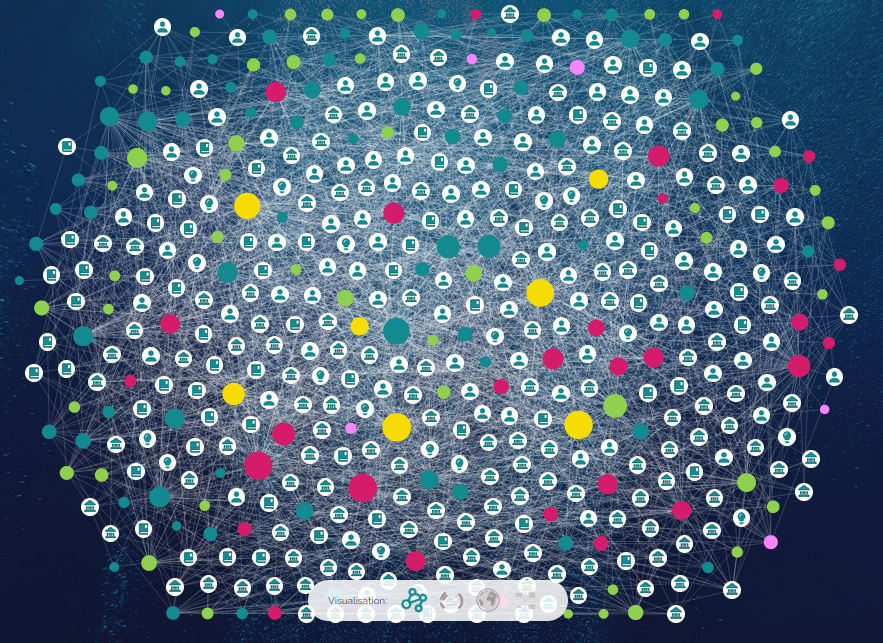
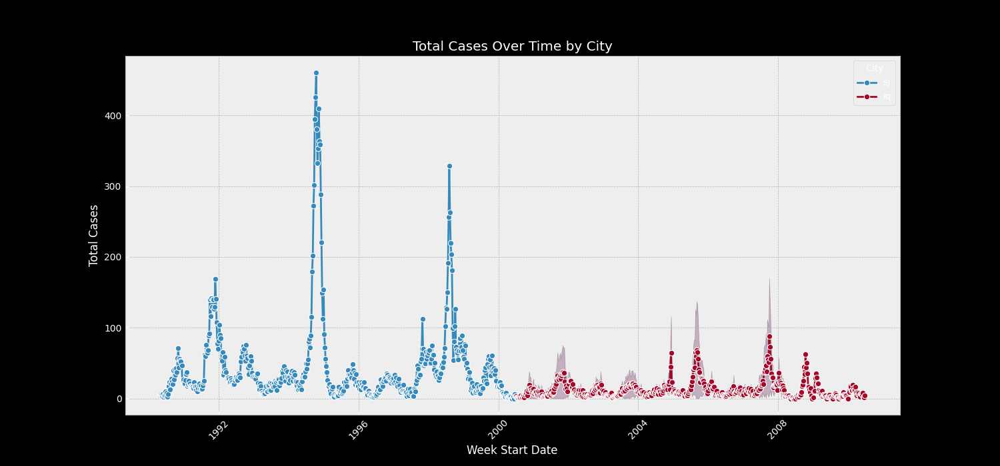
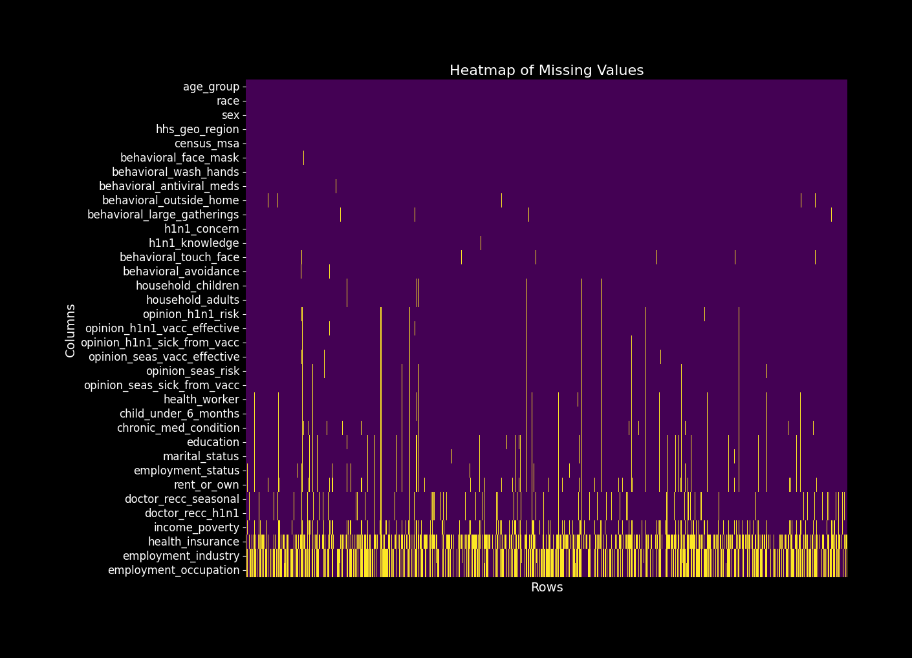
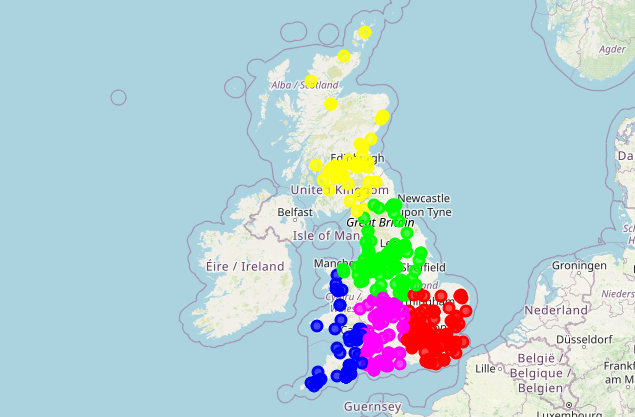
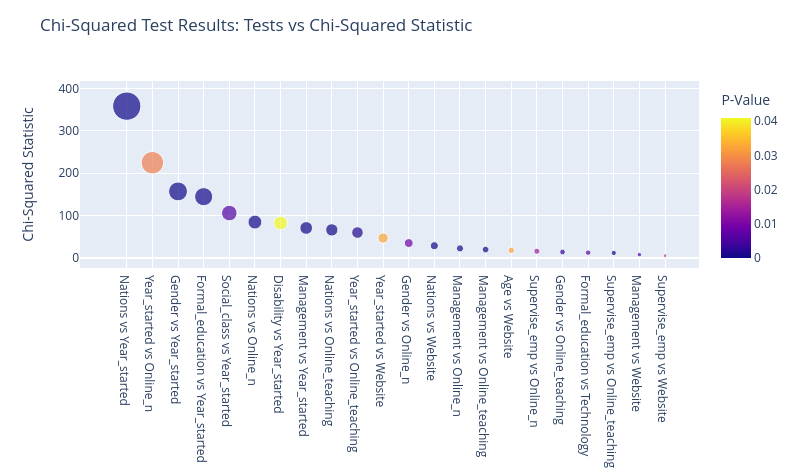
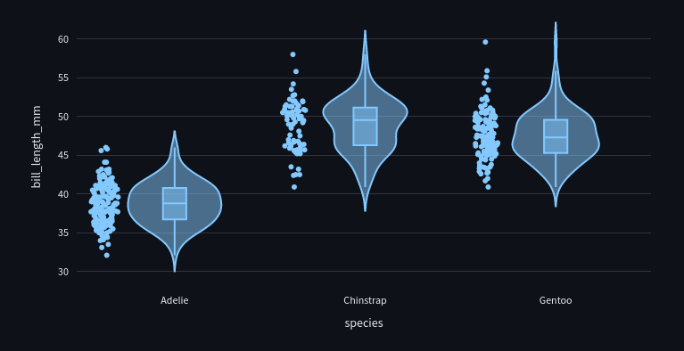
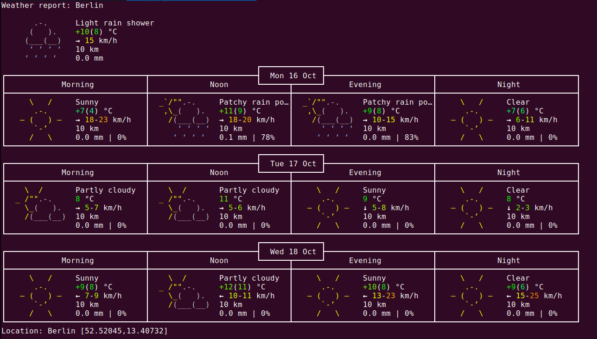

# A Mindset for the Anthropocene



This project involved network visualisation of resources for sustainable futures: [A Mindset for the Anthropocene](https://www.ama-project.org/explore/)

# App Store Review Analyser

Streamlit app provides insightful analysis of App Store reviews for any given app. By inputting the App Store URL, users can explore trends, sentiments, and summaries of reviews within a specified date range.

The app is available for use with OpenAI GPT-3.5 or GPT-4 API here: [App with OpenAI](https://user-reviews.streamlit.app/) or with DistilBart here: [App with BART](https://user-reviews-bart.streamlit.app/).

Click here for the GitHub repositories for [OpenAI API](https://github.com/josh-nowak/user-reviews) and [DistilBart](https://github.com/carecodeconnect/user-reviews-bart)

# Automatic Customer Review Analyser

This project uses Machine Learning to turn customer reviews into actionable insights. It uses classification, implementing Linear Classifiers (Perceptron, Average Perceptron, and Pegasos Algorithm), to classify the reviews as ‘positive’ or ‘negative’. Focusing on Amazon’s food product reviews, this system employs sentiment analysis to categorize feedback, providing an automated, efficient, and scalable approach to handling customer reviews.

[Click for GitHub repository](https://github.com/carecodeconnect/automatic-review-analyzer)

# [Building a Data Science Server on Raspberry Pi](_site/projects/server/server.html)

```{mermaid}
graph TD;
    A[Raspberry Pi 5] -->|Hosts| B[Ubuntu Server];
    B --> C[SSH for Remote Access];
    B -->|Web Server| D[NGINX];
    D --> E[UFW Firewall];
    D -->|SSL Encryption| F[SSL Certificates];
    B -->|Publishing & Presentation| G[Quarto];
    G -->|Content Editing| H[Visual Studio Code];
    G -->|Version Control| I[Git with GitHub];
    H -->|Remote Development| J[VS Code Remote Development Extension];

    style A fill:#f9f,stroke:#333,stroke-width:2px
    style B fill:#fcf,stroke:#333,stroke-width:2px
    style C fill:#cff,stroke:#333,stroke-width:2px
    style D fill:#fcf,stroke:#333,stroke-width:2px
    style E fill:#cff,stroke:#333,stroke-width:2px
    style F fill:#fcf,stroke:#333,stroke-width:2px
    style G fill:#cff,stroke:#333,stroke-width:2px
    style H fill:#fcf,stroke:#333,stroke-width:2px
    style I fill:#cff,stroke:#333,stroke-width:2px
    style J fill:#fcf,stroke:#333,stroke-width:2px

```

A tutorial to build a self-hosted data science server on a Raspberry Pi 5.

# Coming Soon

The following projects are work-in-progress and coming soon!

- **Job Seeker**: automates the process of finding a job.

- **Lease Linker**: automates the process of finding accommodation.

- **Wine Review Analyser**: employs pandas, scikit-learn, and sentiment analysis to model wine sales and reviews.

# Data Visualisation with D3

Work-in-progress sandbox of a D3 app deployed with GitHub Projects.

[Click for GitHub repository](https://github.com/carecodeconnect/data-visualisation-d3)

# DengAI: Predicting Disease Spread



Predicting local epidemics of dengue fever in San Juan (Puerto Rico) and Iquitos (Peru) to help fight life-threatening pandemics. This is a time series project using Random Forest and Negative Binomial regression models to predict the total cases of Dengue fever over time in the different cities. The predictor variables include environmental variables describing changes in temperature, precipitation, vegitation, and more. We used the Mean Squared Error (MSE) metric for evaluating the model.

[Click for Streamlit app](https://dengai.streamlit.app/)

[Click for GitHub repository](https://github.com/carecodeconnect/dengai)

# Digit Recogniser

Deep learning neural network which recognises handwritten digits. It develops a Multi-Level Perceptron (MLP) model for handwritten digit recognition using the MNIST dataset, implemented entirely by hand using Python's NumPy library. The project emphasizes Object-Oriented Programming (OOP) for a modular and clear code structure.

[Click for GitHub repository](https://github.com/carecodeconnect/digit-recogniser)

# Flu Shot Learning



Predicts how likely individuals are to receive their H1N1 and seasonal flu vaccines based upon various features collected in a survey. The dataset includes characteristics like behavioral responses, opinions, and personal information gathered from respondents. Some of the features have missing values, which became an important part of the Exploratory Data Analysis, with implications for how we understand the data. We built a Streamlit app to allow interactive visualisation of hidden patterns in the Missing Values!

[Click for Streamlit app](https://flu-shot-learning.streamlit.app/)

[Click for GitHub repository](https://github.com/carecodeconnect/flu-shot-learning)

# Jhāna.AI: Personal Meditation Guide


Interactive voice assistant which uses real-time brain sensing to guide the user in ancient Jhana Meditation, for reaching states of concentration, bliss and calm, and finding relief from pain. `Jhāna.AI` uses cutting-edge technologies of biofeedback, deep learning, and natural language processing for personalised guided meditation sessions.

[Click for GitHub repository](https://github.com/carecodeconnect/jhana-dev)

# [MapMind (Part I): Mapping the Mindfulness Movement](_site/projects/mapmind/mapmind_mapping.html)



The MapMind project studied the people at the forefront of the mindfulness movement. The analysis in this report utilized the Machine Learning algorithm **K-Means clustering** to explore the urban concentrations of mindfulness teaching, demonstrating its effectiveness in handling nationwide geospatial datasets.

# [MapMind (Part II): Who Are Mindfulness Teachers?](_site/projects/mapmind/mapmind_demographics.html)


In Part II of the MapMind project, we explore the demographics of mindfulness teachers. We use **Exploratory Data Analysis** (EDA) and **data visualisation** to reveal the hidden patterns in the survey data using descriptive statistics.

# [MapMind (Part III): Digital Divides: Mindfulness Teaching & Technology](_site/projects/mapmind/mapmind_technology.html)



The final part of the MapMind project looks at how mindfulness teachers relate to technology, and uses predictive modeling using **Chi-Squared tests** and **logistic regression** to identify the factors that predict whether mindfulness teachers engage in online teaching based on several features, including gender, years of teaching experience, whether they hold a management position, and their nationality.

# Movie Recommender with Ridge Regression

This project provides accurate movie recommendations based on user preferences and historical ratings data. The recommender uses **Ridge regression** to learn to predict ratings based on a substantial amount of data. The results indicate a relatively low average deviation of the predicted ratings from the actual ratings, demonstrating the model's effectiveness in making accurate predictions.

[Click for GitHub repository](https://github.com/carecodeconnect/movie_recommender)

# [Palmer Penguins](https://cute-palmer-penguins.streamlit.app/)



Streamlit app using the Palmer Penguins dataset. The Palmer Penguins dataset is a popular dataset for data exploration and visualization. We use the dataset to create a simple Streamlit app that includes a bar chart, scatter plot, violin plots, and a YouTube video.

[Click for GitHub repository](https://github.com/carecodeconnect/palmer-penguins)

# Programming Languages Popularity

Interactive dashboard visualising data from various developer surveys, including the Statista Programming Survey, the Stack Overflow Developer Survey, and the JetBrains Developer Ecosystem Survey. Users can select the survey of interest from the sidebar and view the top programming languages according to that survey.

[Click for Streamlit app](https://python-surveys.streamlit.app/)

[Click for GitHub repository](https://github.com/carecodeconnect/python-surveys)

# Richter's Predictor: Modeling Earthquake Damage


Based on aspects of building location and construction, this project predicts the level of damage to buildings caused by the 2015 Gorkha earthquake in Nepal. Our team of data scientists from [Data Science Retreat](https://datascienceretreat.com/) developed a model to predict the level of damage to the buildings. We used a variety of machine learning models, including **Logistic Regression**, **Gradient Boosting**, **XGBoost**, and **Neural Networks**. This project uses data provided by [DrivenData](https://www.drivendata.org/). The data was collected through surveys by Kathmandu Living Labs and the Central Bureau of Statistics, which works under the National Planning Commission Secretariat of Nepal. This survey is one of the largest post-disaster datasets ever collected, containing valuable information on earthquake impacts, household conditions, and socio-economic-demographic statistics.

[Click for GitHub repository](https://github.com/carecodeconnect/richters-predictor)

# Weather Analysis Toolkit



This project is a toolkit for fetching, analyzing, and generating reports on weather data. It assesses forecast accuracy over time and understanding weekly weather statistics. This version of the toolkit reports today's weather and the forecast weather for tomorrow at noon in Berlin.

[Click for GitHub repository](https://github.com/carecodeconnect/weather)
