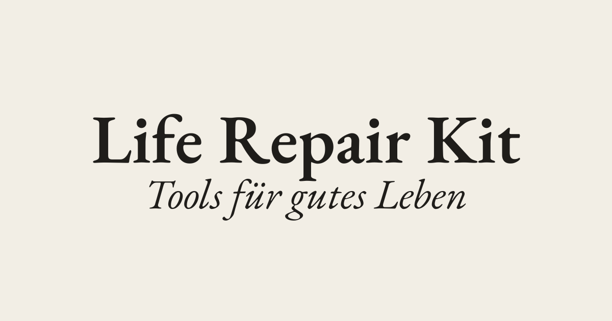

```{=html}
<style>
  /* hide the duplicate default title — the logo hero is the title */
  #title-block-header { display: none; }

  /* transparent logo that adapts to light/dark instead of a white box */
  .lrk-logo-img { width:min(460px,84%); height:auto; display:block; margin:0 auto; }
  body.quarto-dark .lrk-logo-img { filter: invert(1) brightness(1.06); }
  .lrk-logo-sub { margin-top:1rem; font-family:'IBM Plex Mono',monospace; font-size:.8rem; letter-spacing:.02em; color:inherit; opacity:.6; }

  /* diagrams: a contained card so they read in light AND dark — and so the
     scroll zoom visibly enlarges them instead of just clipping a full-width svg */
  .lrk-diagram { background:#fdfbf5; border:1px solid #E4DED2; border-radius:14px; padding:1rem; }
  .cr-section .sticky-col svg { width: 100% !important; height: auto !important; max-width: 560px; margin-inline: auto; display: block; }
  .cr-section .sticky-col img { width: 100% !important; height: auto !important; max-width: 520px; margin-inline: auto; display: block; }
  .cr-section .sticky-col .cell,
  .cr-section .sticky-col .cell-output-display,
  .cr-section .sticky-col figure { width: 100%; margin: 0; }
  .cr-section .sticky { transform-origin: center center; }
  .cr-section .sticky-col { min-height: 60vh; }
  /* stickies without zoom steps must never resize on scroll */
  #cr-radar.sticky, #cr-values.sticky, #cr-privacy.sticky { transform: none !important; }

  /* pin the visual to the inner edge and hug the narrative → small gap */
  .cr-section .narrative-col > * { max-width: 27rem; }
  .cr-section.sidebar-left  .narrative-col { text-align: right; }
  .cr-section.sidebar-left  .narrative-col > * { margin-left: auto; margin-right: 0; }
  .cr-section.sidebar-left  .sticky-col-stack .sticky { margin-left: 2.5rem; margin-right: auto; }
  .cr-section.sidebar-right .narrative-col { text-align: left; }
  .cr-section.sidebar-right .narrative-col > * { margin-right: auto; margin-left: 0; }
  .cr-section.sidebar-right .sticky-col-stack .sticky { margin-right: 2.5rem; margin-left: auto; }

  /* generous breathing room around the between-section interludes */
  .lrk-interlude { max-width: 42rem; margin: 4rem auto 1.5rem; }
  .lrk-interlude h2 { margin-bottom: .6rem; }

  /* warm-white LRK card used for the sticky visuals */
  .lrk-card { background:#FAF8F4; border:1px solid #E4DED2; border-radius:16px; padding:1.75rem 1.5rem; color:#1F1D1A; }
  .lrk-card img { border-radius: 10px; }
</style>
```

::: {.cr-section layout="sidebar-right"}

::: {#cr-values}
```{=html}
<div class="lrk-card" style="max-width:520px;margin:0 auto;padding:0;overflow:hidden;">
  
</div>
```
:::

::: {focus-on="cr-values"}
Scroll to read the journey of building **[Life Repair Kit](https://www.liferepairkit.de/)** — a German-language wellbeing tool.
:::

::: {focus-on="cr-values"}
**Care & well-being.** The product itself helps people notice where life is strained — and find support.
:::

::: {focus-on="cr-values"}
**Ethics & privacy.** EU data sovereignty, cookieless analytics, on-device PDF generation, and measurement designed not to bias the person taking it.
:::

::: {focus-on="cr-values"}
**Sustainability.** A small Rust binary and framework-free frontend on scale-to-zero, renewable-energy EU cloud — low bandwidth, low compute.
:::

::: {focus-on="cr-values"}
**Free & open source — pragmatically.** [Rust](https://www.rust-lang.org/), [TypeScript](https://www.typescriptlang.org/), [PostgreSQL](https://www.postgresql.org/), [Typst](https://typst.app/), [Caddy](https://caddyserver.com/), [Umami](https://umami.is/) — an open, self-owned stack with people, not platforms, at the centre. And where buying beat building ([Mailcoach](https://mailcoach.app/)), we said so plainly rather than force the ideology.
:::

:::

::: {.cr-section layout="sidebar-left"}

::: {#cr-radar}
```{=html}
<div class="lrk-card" style="width:560px;max-width:100%;margin:0 auto;padding-top:1.5rem;padding-bottom:1.25rem;">
  <div id="lrk-radar-svg" style="width:100%;margin:0 auto;"></div>
  <div style="margin-top:14px;text-align:center;min-height:80px;">
    <div id="lrk-radar-index" style="font-size:10px;letter-spacing:.14em;text-transform:uppercase;color:rgba(31,29,26,.55);margin-bottom:6px;">Profil · 01 / 04</div>
    <div id="lrk-radar-name" style="font-family:'EB Garamond',Georgia,serif;font-size:26px;line-height:1.15;font-weight:500;"></div>
    <div id="lrk-radar-note" style="font-family:'EB Garamond',Georgia,serif;font-size:16px;font-style:italic;color:rgba(31,29,26,.7);margin-top:4px;"></div>
  </div>
  <div id="lrk-radar-dots" style="display:flex;gap:8px;margin-top:14px;justify-content:center;"></div>
</div>
<script>
(function () {
  var AREAS = [
    { label: "Nervensystem", color: "#F5C842" },
    { label: "Körper",       color: "#F5C842" },
    { label: "Geist",        color: "#F5C842" },
    { label: "Familie",      color: "#D63C2F" },
    { label: "Intimität",    color: "#D63C2F" },
    { label: "Zuhause",      color: "#D63C2F" },
    { label: "Arbeit",       color: "#2B4EA8" },
    { label: "Kreativität",  color: "#2B4EA8" },
    { label: "Sinn",         color: "#2B4EA8" },
    { label: "Storytelling", color: "#1F1D1A" }
  ];
  var PROFILES = [
    { name: "Vieles trägt – einiges wackelt", note: "Ein Alltag, der grundsätzlich funktioniert, mit ein paar dünnen Stellen.", scores: [2,2,4,2,2,3,4,2,3,2] },
    { name: "In der Krise",                   note: "Gerade hält wenig. Auch das darf sichtbar werden.",                        scores: [1,1,1,2,1,2,2,1,1,1] },
    { name: "Wieder im Gleichgewicht",        note: "Ein tragfähiges Fundament über fast alle Bereiche.",                       scores: [4,4,3,4,3,4,3,4,4,3] },
    { name: "In voller Kraft",                note: "Nahezu alle Lebensbereiche tragen zuverlässig.",                           scores: [5,5,5,5,4,5,4,5,5,4] }
  ];
  var SIZE = 520, CX = 260, CY = 260, RINGS = 5, R = 190, CENTER_R = 36, LABEL_R = 214, N = AREAS.length;
  function ang(i, off) { return (Math.PI * 2 * (i + off)) / N - Math.PI / 2; }
  function wedge(i, score) {
    var a1 = ang(i, -0.5), a2 = ang(i, 0.5), r = (score / RINGS) * R;
    var x1 = CX + Math.cos(a1) * r, y1 = CY + Math.sin(a1) * r;
    var x2 = CX + Math.cos(a2) * r, y2 = CY + Math.sin(a2) * r;
    return "M " + CX + " " + CY + " L " + x1.toFixed(2) + " " + y1.toFixed(2) +
           " A " + r.toFixed(2) + " " + r.toFixed(2) + " 0 0 1 " + x2.toFixed(2) + " " + y2.toFixed(2) + " Z";
  }
  function build() {
    var rings = "";
    for (var k = 1; k <= RINGS; k++) {
      rings += '<circle cx="' + CX + '" cy="' + CY + '" r="' + ((k / RINGS) * R).toFixed(1) + '" fill="none" stroke="rgba(31,29,26,0.12)" stroke-width="0.6"/>';
    }
    var spokes = "", labels = "", wedges = "";
    AREAS.forEach(function (a, i) {
      var sa = ang(i, -0.5), sx = CX + Math.cos(sa) * R, sy = CY + Math.sin(sa) * R;
      spokes += '<line x1="' + CX + '" y1="' + CY + '" x2="' + sx.toFixed(2) + '" y2="' + sy.toFixed(2) + '" stroke="rgba(31,29,26,0.12)" stroke-width="0.6"/>';
      var la = ang(i, 0), lx = CX + Math.cos(la) * LABEL_R, ly = CY + Math.sin(la) * LABEL_R, cosA = Math.cos(la);
      var anc = Math.abs(cosA) < 0.2 ? "middle" : cosA > 0 ? "start" : "end";
      labels += '<text x="' + lx.toFixed(2) + '" y="' + ly.toFixed(2) + '" text-anchor="' + anc + '" dominant-baseline="middle" font-family="Inter,Helvetica,Arial,sans-serif" font-size="11" font-weight="500" letter-spacing="0.02em" fill="#1F1D1A">' + a.label + '</text>';
      wedges += '<path data-i="' + i + '" d="" fill="' + a.color + '" fill-opacity="0.92" stroke="#FAF8F4" stroke-width="1" stroke-linejoin="round" style="transition:d 900ms cubic-bezier(.5,.1,.3,1),fill 900ms ease"/>';
    });
    return '<svg viewBox="0 0 ' + SIZE + ' ' + SIZE + '" style="width:100%;height:auto;display:block;overflow:visible" role="img" aria-label="ResilienzRadar – animierte Beispielprofile">' +
      '<g>' + rings + spokes + wedges + '</g>' + labels +
      '<g style="pointer-events:none"><circle cx="' + CX + '" cy="' + CY + '" r="' + CENTER_R + '" fill="#FAF8F4" stroke="rgba(31,29,26,0.15)" stroke-width="1"/>' +
      '<text x="' + CX + '" y="' + (CY - 4) + '" text-anchor="middle" font-family="EB Garamond,Georgia,serif" font-size="12" font-style="italic" fill="#1F1D1A">Resilienz</text>' +
      '<text x="' + CX + '" y="' + (CY + 10) + '" text-anchor="middle" font-family="EB Garamond,Georgia,serif" font-size="12" font-style="italic" fill="#1F1D1A">Radar</text></g></svg>';
  }
  function init() {
    var root = document.getElementById("lrk-radar-svg");
    if (!root) return;
    root.innerHTML = build();
    var paths = root.querySelectorAll("path[data-i]");
    var nameEl = document.getElementById("lrk-radar-name");
    var noteEl = document.getElementById("lrk-radar-note");
    var idxEl = document.getElementById("lrk-radar-index");
    var dotsWrap = document.getElementById("lrk-radar-dots");
    var idx = 0;
    var dots = PROFILES.map(function (p, i) {
      var b = document.createElement("button");
      b.type = "button";
      b.setAttribute("aria-label", p.name);
      b.style.cssText = "width:9px;height:9px;border-radius:50%;border:0;padding:0;cursor:pointer;background:rgba(31,29,26,0.2);transition:background 300ms ease";
      dotsWrap.appendChild(b);
      b.addEventListener("click", function () { paint(i); });
      return b;
    });
    function paint(i) {
      idx = i;
      var p = PROFILES[i];
      nameEl.textContent = p.name;
      noteEl.textContent = p.note;
      idxEl.textContent = "Profil · " + String(i + 1).padStart(2, "0") + " / 0" + PROFILES.length;
      paths.forEach(function (path) {
        var pi = Number(path.getAttribute("data-i"));
        var s = p.scores[pi] || 0;
        path.setAttribute("d", s === 0 ? "" : wedge(pi, s));
      });
      dots.forEach(function (d, di) { d.style.background = di === i ? "#1F1D1A" : "rgba(31,29,26,0.2)"; });
    }
    paint(0);
    // scroll-driven: pin each narrative phase to a radar profile
    var phases = Array.prototype.slice.call(document.querySelectorAll('[data-focus-on="cr-radar"][data-phase]'));
    if (phases.length && "IntersectionObserver" in window) {
      var io = new IntersectionObserver(function (entries) {
        entries.forEach(function (e) {
          if (e.isIntersecting) {
            var p = parseInt(e.target.getAttribute("data-phase"), 10);
            if (!isNaN(p)) paint(p);
          }
        });
      }, { rootMargin: "-45% 0px -45% 0px", threshold: 0 });
      phases.forEach(function (s) { io.observe(s); });
    }
  }
  if (document.readyState === "loading") document.addEventListener("DOMContentLoaded", init);
  else init();
})();
</script>
```
:::

::: {focus-on="cr-radar" .radar-phase data-phase="0"}
### The ResilienzRadar

The **ResilienzRadar** maps ten life dimensions in four clusters — **Self** (yellow), **With others** (red), **World** (blue), **Storytelling** (black). It asks not *what is broken?* but *where is life stable — and where is it shaky?* Here: a life that mostly holds, with a few thin spots. *(Scroll to watch it change.)*
:::

::: {focus-on="cr-radar" .radar-phase data-phase="1"}
**In acute crisis**, little holds — the wedges pull in toward the centre. That's allowed to be visible; the radar just shows the shape of it, with no numbers to decode.
:::

::: {focus-on="cr-radar" .radar-phase data-phase="2"}
**Back in balance.** A load-bearing foundation returns across most areas — each wedge grows from the centre as that dimension starts to carry weight again.
:::

::: {focus-on="cr-radar" .radar-phase data-phase="3"}
**In full strength**, nearly every dimension carries reliably. It's the same animated component that greets visitors on the [live site](https://www.liferepairkit.de/radar).
:::

:::

::: {.lrk-interlude}
## How the ResilienzRadar is created

This is where the project is most recognisably a **data** project: a radar is only as trustworthy as the instrument behind it, so the measurement design received the same care as the code.
:::

::: {.cr-section layout="sidebar-right"}

::: {#cr-pipeline .lrk-diagram}
```{dot}
digraph {
  bgcolor="transparent"; rankdir=LR; nodesep=0.28; ranksep=0.55;
  node [shape=box, style="rounded,filled", fillcolor="white", color="#333333", fontcolor="#111111", fontname="Inter,Helvetica,Arial,sans-serif", fontsize=15, margin="0.24,0.16"];
  edge [color="#666666", penwidth=1.4, arrowsize=0.8];
  Q    [label="📝  50 Likert items\n10 dimensions"];
  ADJ  [label="🔄  invert reverse items\n6 − raw"];
  DIM  [label="📊  dimension score\n= mean of items"];
  MAP  [label="🎯  10-dimension\nscore map"];
  POST [label="🗄️  Postgres\nJSON · UUID"];
  SVG  [label="🕸️  interactive SVG"];
  OG   [label="🖼️  server radar.svg"];
  PDF  [label="📄  Typst-WASM PDF\non device"];
  Q -> ADJ -> DIM -> MAP;
  MAP -> POST; MAP -> SVG; MAP -> OG; MAP -> PDF;
}
```
:::

::: {focus-on="cr-pipeline" scale-by="1.9" pan-to="80%,3%"}
**The quiz.** Fifty statements on a five-point scale (*"does not apply at all"* → *"fully applies"*). The items were carefully curated — distilled from the project's bespoke wellbeing resource hub and written on established **psychometric measurement principles**: balanced positive/negative keying, plain single-idea wording, and dimensions kept conceptually distinct.
:::

::: {focus-on="cr-pipeline" scale-by="1.9" pan-to="40%,3%"}
**Reverse-scored "strain" items.** When *agreement signals difficulty* ("I often feel tense inside…"), the raw value is inverted — `6 − raw` — **before** aggregation, so a high number always means "doing well," whichever way an item is phrased.
:::

::: {focus-on="cr-pipeline" scale-by="1.9" pan-to="-1%,3%"}
**Scoring.** Each dimension is the *mean* of its adjusted items — a mean, not a sum, so dimensions with different item counts stay comparable on one 1–5 scale. Unanswered dimensions render no wedge but keep their spoke, so a partial result is still honest.
:::

::: {focus-on="cr-pipeline" scale-by="1.4" pan-to="-57%,0%"}
**One map, three renderings.** From a single score map: an interactive SVG on the page, a server-rendered `radar.svg` for link previews, and a **PDF typeset on the user's own device** via Typst-WASM — results never travel to a server to become a document.
:::

:::

::: {.lrk-interlude}
## The system that delivers it

One Rust binary serves the API and the static frontend; the browser does the scoring and typesets the PDF itself; everything data-bearing stays in the EU.
:::

::: {.cr-section layout="sidebar-left"}

::: {#cr-arch .lrk-diagram}
```{dot}
digraph {
  bgcolor="transparent"; rankdir=TB; nodesep=0.35; ranksep=0.55; compound=true;
  node [shape=box, style="rounded,filled", fillcolor="white", color="#333333", fontcolor="#111111", fontname="Inter,Helvetica,Arial,sans-serif", fontsize=15, margin="0.24,0.15"];
  edge [color="#666666", fontcolor="#444444", fontname="Inter,Helvetica,Arial,sans-serif", fontsize=11, penwidth=1.4, arrowsize=0.8];

  subgraph cluster_browser {
    label="🌐  Browser · client"; fontname="Inter,Arial,sans-serif"; fontsize=13; fontcolor="#555"; color="#cbc6ba"; style="rounded";
    UI   [label="⌨️  Vanilla TS + Vite\nquiz · scoring · SVG radar"];
    WASM [label="📄  Typst → WebAssembly\non-device PDF"];
  }
  subgraph cluster_edge {
    label="☁️  Scaleway Serverless · Paris"; fontsize=13; fontcolor="#555"; color="#cbc6ba"; style="rounded";
    API [label="🦀  Rust · Axum binary\nstatic assets + /api"];
  }
  DB [label="🗄️  PostgreSQL\nManaged · EU", shape=cylinder, margin="0.18,0.12"];
  subgraph cluster_services {
    label="🔒  Self-hosted · Caddy TLS"; fontsize=13; fontcolor="#555"; color="#cbc6ba"; style="rounded";
    UM [label="📊  Umami\ncookieless analytics"];
    N8 [label="⚙️  n8n\nautomations"];
  }
  MC [label="✉️  Mailcoach · hosted\nemail · EU"];
  subgraph cluster_ci {
    label="🔧  CI/CD"; fontsize=13; fontcolor="#555"; color="#cbc6ba"; style="rounded";
    GH  [label="🐙  GitHub Actions"];
    REG [label="📦  Container Registry"];
  }

  UI  -> API [label="scores · JSON"];
  UI  -> WASM;
  API -> DB  [label="sqlx"];
  API -> MC  [label="HMAC webhooks", dir=both];
  UI  -> UM  [label="events", style=dashed];
  GH  -> REG;
  REG -> API;
}
```
:::

::: {focus-on="cr-arch"}
The whole system is deliberately **few moving parts** — one artifact to deploy, one database, a handful of self-hosted services. Zoom in as we walk through it.
:::

::: {focus-on="cr-arch" scale-by="1.7" pan-to="6%,-1%"}
**Browser.** The frontend is vanilla [TypeScript](https://www.typescriptlang.org/) + [Vite](https://vite.dev/) — no [React](https://react.dev/), no [Tailwind](https://tailwindcss.com/). It runs the quiz, computes the scores, and typesets the results PDF with [Typst](https://typst.app/) compiled to WebAssembly. Brand fonts are self-hosted; no third-party CDN at runtime.
:::

::: {focus-on="cr-arch" scale-by="2.0" pan-to="60%,-29%"}
**The binary.** A single [Rust](https://www.rust-lang.org/)/[Axum](https://github.com/tokio-rs/axum) process — chosen for its small, self-contained binary with no runtime interpreter — serves both the JSON API under `/api` and the built static frontend. [`sqlx`](https://github.com/launchbadge/sqlx) talks to [PostgreSQL](https://www.postgresql.org/); Argon2 hashes admin passwords; the Magazin is rendered from Markdown with [`pulldown-cmark`](https://github.com/pulldown-cmark/pulldown-cmark).
:::

::: {focus-on="cr-arch" scale-by="1.7" pan-to="-48%,-25%"}
**Platform & services.** Everything runs on [Scaleway](https://www.scaleway.com/) (Paris) — managed Postgres, serverless containers, and a registry fed by [GitHub Actions](https://github.com/features/actions). Analytics is self-hosted [Umami](https://umami.is/), chosen over [Plausible](https://plausible.io/) and [Pirsch](https://pirsch.io/); automations run on self-hosted [n8n](https://n8n.io/), all behind [Caddy](https://caddyserver.com/).
:::

::: {focus-on="cr-arch" scale-by="1.9" pan-to="35%,-76%"}
**Build vs buy.** For email campaigns we chose hosted [**Mailcoach**](https://mailcoach.app/) (EU) over self-hosting [listmonk](https://listmonk.app/) and over [ConvertKit](https://kit.com/) — the one deliberate "buy" in an otherwise self-hosted, open-source stack. Email deliverability is a deep, thankless problem worth outsourcing.
:::

::: {focus-on="cr-arch"}
**The tradeoffs, briefly.** One Rust binary means longer compiles but a tiny footprint. Vanilla TS means more DOM code by hand but a small, fast bundle. Client-side Typst-WASM ships a compiler but keeps results on-device. Scaleway EU means a smaller ecosystem than AWS but data sovereignty and renewable energy by construction.
:::

:::

::: {.lrk-interlude}
## Full-stack decisions, from the repo

"Full-stack" shows up as a chain of small, specific choices where the frontend, backend, and infrastructure meet.
:::

::: {.cr-section layout="sidebar-right"}

::: {#cr-routing .lrk-diagram}
```{dot}
digraph {
  bgcolor="transparent"; rankdir=TB; nodesep=0.4; ranksep=0.5;
  node [shape=box, style="rounded,filled", fillcolor="white", color="#333333", fontcolor="#111111", fontname="Inter,Helvetica,Arial,sans-serif", fontsize=15, margin="0.24,0.15"];
  edge [color="#666666", fontcolor="#444444", fontname="Inter,Helvetica,Arial,sans-serif", fontsize=12, penwidth=1.4, arrowsize=0.8];
  REQ   [label="📥  incoming request"];
  Q     [label="path starts with /api ?", shape=diamond, fillcolor="#f3eede", margin="0.1,0.04"];
  API   [label="🔌  JSON API handlers\nquiz · magazin · admin"];
  SAFE  [label="safe path & file exists?", shape=diamond, fillcolor="#f3eede", margin="0.1,0.04"];
  FILE  [label="📄  serve static file\nfrontend/dist"];
  SHELL [label="🖥️  SPA shell +\nper-route SEO meta"];
  REQ -> Q;
  Q -> API   [label="  yes"];
  Q -> SAFE  [label="  no"];
  SAFE -> FILE  [label="  yes"];
  SAFE -> SHELL [label="  no"];
}
```
:::

::: {focus-on="cr-routing" scale-by="1.7" pan-to="41%,33%"}
**One process, two jobs.** `main.rs` mounts the API under `.nest("/api", …)` and sends everything else to `.fallback(static_files::serve)` — the same binary is API server and web server for the SPA.
:::

::: {focus-on="cr-routing" scale-by="1.8" pan-to="-63%,-70%"}
**SEO for a client-rendered SPA.** A naïve SPA serves crawlers an empty shell. The static fallback instead rewrites `<title>`, description, and Open Graph tags per route (`static_files.rs` + `seo.rs`), mirrored client-side in `seo.ts`.
:::

::: {focus-on="cr-routing" scale-by="1.8" pan-to="-33%,-17%"}
**Security at the fallback boundary.** Axum doesn't normalise `..` in fallbacks, so a path-traversal guard sends `/../../proc/self/environ` to the SPA instead of leaking the container's secrets.
:::

::: {focus-on="cr-routing"}
**Designing for ephemeral compute.** Serverless Containers have no persistent disk, so Magazin images live in PostgreSQL and stream from `/api/magazin/image/{uuid}` — the storage choice is dictated by the hosting model.
:::

:::

::: {.lrk-interlude}
## Privacy is the architecture

For a German audience and sensitive wellbeing data, privacy isn't bolted on — it's *why* several choices above were made.
:::

::: {.cr-section layout="sidebar-left"}

::: {#cr-privacy}
```{=html}
<div class="lrk-card" style="max-width:420px;margin:0 auto;text-align:center;">
  <svg viewBox="0 0 200 200" style="width:100%;max-width:300px;margin:0 auto;display:block" role="img" aria-label="EU data-protection emblem">
    <circle cx="100" cy="100" r="94" fill="#2B4EA8"/>
    <g fill="#F5C842" font-family="Inter,Arial,sans-serif" font-size="20" text-anchor="middle" dominant-baseline="central">
      <text x="100" y="30">★</text><text x="135" y="39">★</text><text x="161" y="65">★</text><text x="170" y="100">★</text>
      <text x="161" y="135">★</text><text x="135" y="161">★</text><text x="100" y="170">★</text><text x="65" y="161">★</text>
      <text x="39" y="135">★</text><text x="30" y="100">★</text><text x="39" y="65">★</text><text x="65" y="39">★</text>
    </g>
    <path d="M88 96 v-8 a12 12 0 0 1 24 0 v8" fill="none" stroke="#FAF8F4" stroke-width="6"/>
    <rect x="80" y="96" width="40" height="34" rx="5" fill="#FAF8F4"/>
    <circle cx="100" cy="110" r="4.5" fill="#2B4EA8"/>
    <rect x="98" y="112" width="4" height="10" rx="2" fill="#2B4EA8"/>
  </svg>
  <div style="margin-top:1rem;font-family:'EB Garamond',Georgia,serif;font-style:italic;font-size:1.05rem;color:#1F1D1A;">GDPR-native by design</div>
</div>
```
:::

::: {focus-on="cr-privacy"}
**EU data residency.** App, database, and registry all live in Scaleway's Paris region. No personal data leaves the EU — no US-hyperscaler processor to cover with Standard Contractual Clauses.
:::

::: {focus-on="cr-privacy"}
**Data minimisation.** The radar needs no account: a result is an anonymous score map keyed by a random UUID. The sensitive results PDF is typeset **on the user's device** and never sent to a server.
:::

::: {focus-on="cr-privacy"}
**Minimal third parties.** Self-hosted [Umami](https://umami.is/) sets no cookies (no consent banner); fonts are self-hosted (no Google Fonts IP leak); no ad or tracking scripts. Email campaigns use [Mailcoach](https://mailcoach.app/), an EU-based processor named in the privacy policy — the sole external processor, kept in-region.
:::

::: {focus-on="cr-privacy"}
**Security of processing (Art. 32).** TLS at Caddy, Argon2 password hashing, constant-time HMAC-SHA256 webhook verification, and the path-traversal guard — the lean stack is also the GDPR-native one.
:::

:::

------------------------------------------------------------------------

::: {style="text-align:center;max-width:42rem;margin:1rem auto;"}
*This page is made with [Closeread](https://closeread.dev/), a scrollytelling custom format for [Quarto](https://quarto.org/).*
:::
